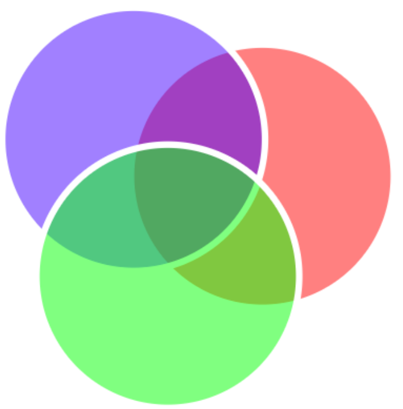

# Практическое задание по преобразованию в SVG

## Описание заданий

- Пусть у нас есть следующее (под)дерево разметки, сделанной на выдуманном математическом языке, но близком к реальности. Например, «низверх» означает одновременное наличие верхнего и нижнего индексов у обозначения суммы ряда.
```
<строка>
    <операнд>σ</операнд>
    <оператор>=</оператор>
    <корень>
        <строка>
            <дробь>
                <строка>
                    <число>1</число>
                </строка>
                <строка>
                    <операнд>N</операнд>
                </строка>
            </дробь>
            <строка>
                <низверх>
                    <строка>
                        <оператор>∑</оператор>
                    </строка>
                    <строка>
                        <операнд>i</операнд>
                        <оператор>=</оператор>
                        <число>1</число>
                    </строка>
                    <строка>
                        <операнд>N</операнд>
                    </строка>
                </низверх>
                <строка>
                    <верх>
                        <строка>
                            <оператор >(</оператор>
                            <низ>
                                <строка>
                                    <операнд>x</операнд>
                                </строка>
                                <строка>
                                    <операнд>i</операнд>
                                </строка>
                            </низ>
                            <оператор>−</оператор>
                            <операнд>μ</операнд>
                            <оператор >)</оператор>
                        </строка>
                        <строка>
                            <число>2</число>
                        </строка>
                    </верх>
                </строка>
            </строка>
        </строка>
    </корень>
    <оператор>.</оператор>
</строка>
```
Напишите XSLT-стили, которые преобразуют это поддерево в поддерево элемента
math с его последующей обработкой по технологии MathJax
- Пожалуйста, создайте XSLT-преобразования для этого документа,чтобы результат выглядет как на иллюстрации ниже.
```
<?xml version="1.0" encoding="utf-8" ?>
<?xml-stylesheet type="text/xsl" href="svg.xsl" ?>
<root>
    <графика ширина="640" высота="480">
        <эллипс id="графика_1" заливка="rgba(255,0,0,0.5)" ободок="white" ширина-ободка="5" cx="206" cy="139" rx="100" ry="100"/>
        <эллипс id="графика_2" заливка="rgba(0,0,255,0.5)" ободок="white" ширина-ободка="5" cx="108" cy="111" rx="100" ry="100"/>
        <эллипс id="графика_3" заливка="rgba(0,255,0,0.5)" ободок="white" ширина-ободка="5" cx="134" cy="215" rx="100" ry="100"/>
    </графика>
</root>
```


## Проект
- Проект доступен по адресу https://madpenguinw.github.io/MathML-SVG/.

## Об авторе

```
developed_by = {'author': 'Mikhail Sokolov',
                'university': 'ITMO',
                'telegram': 't.me/lmikhailsokolovl',
                'is_it_funny': 'A little bit'}
```